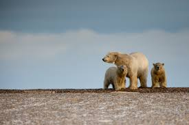
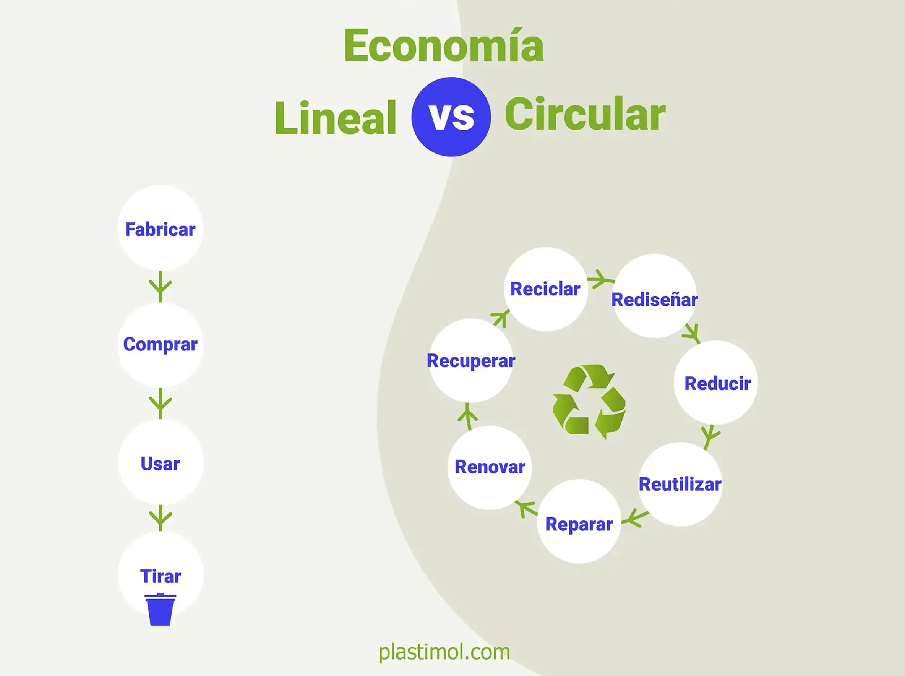

# Bitácora de Clases

---

---

## Enero 
## 23/01/2026
## En la clase de hoy
Plan de sostenibilidad empresarial 
Los objetivos que se desarrollan para la realización de las actividades empresariales se fundamentan, principalmente, en las normas ISO 9000 e ISO 14000, que establecen criterios de calidad y gestión ambiental. La sostenibilidad no debe entenderse como una opción, sino como una condición necesaria para la supervivencia, ya que existe una clara ecodependencia: la economía depende de ecosistemas saludables y de sociedades funcionales.

Actualmente, el planeta se encuentra en una situación de translimitación, habiéndose superado seis de los nueve límites planetarios, lo que convierte a la sostenibilidad en una respuesta imprescindible. Para ello, la anatomía de un plan de sostenibilidad exige la definición previa de acciones, el uso de indicadores clave de rendimiento (KPI) puesto que lo que no se mide no se puede mejorar y la elaboración de un informe de sostenibilidad que refleje los resultados obtenidos.

¿Son greenwashing los planes de sostenibilidad que hemos comentado anteriormente?
Los planes de sostenibilidad no son greenwashing cuando se aplican de verdad, con acciones claras, mediciones y resultados visibles.
Sin embargo, sí lo son cuando solo se usan como discurso o publicidad, sin cambios reales en la empresa. 
Lo importante no es decir que se es sostenible, sino demostrarlo con hechos.
## 16/01/2026
## En la clase de hoy 

## Objetivos de desarrollo sostenible agenda 2030 ODS

Se trata de una serie de objetivos sostenibles que se quieren alcanzar para reducir la contaminación. Desde mi punto de vista, se quieren conseguir demasiadas cosas de golpe, lo cual es imposible de lograr de un día para otro, pero sí creo que debemos empezar a trabajar en esos objetivos desde ya.

¿Por qué se hace esto?
En 2015, la situación del planeta estaba empeorando a pasos gigantes, por lo que el estado decidió tomar cartas en el asunto y crear esta agenda para tratar de mejorarla.

¿Se van a coseguir los objetivos  de desarrollo sostenible y porque?
No se sabe si se van a conseguir todos los Objetivos de Desarrollo Sostenible, porque son metas muy ambiciosas y algunas dependen de cambios grandes en la forma en que vivimos y producimos. Sin embargo, se puede avanzar mucho si los gobiernos, las empresas y las personas trabajamos juntos, empezando por acciones pequeñas que sumen para alcanzar estos objetivos a largo plazo.
## 09/01/2026
## En la clase de hoy
Contaminación y residuos

Los residuos son restos o desechos que ya no utilizamos y tiramos a la basura. Cuando no se gestionan correctamente, provocan contaminación, que afecta tanto al medio ambiente como a los seres vivos. Hoy en día, una de las formas de contaminación más importantes es la causada por la tecnología, ya que el uso continuo de aparatos electrónicos ha aumentado mucho la basura electrónica. Este tipo de residuos contiene materiales tóxicos que resultan muy contaminantes.

Estos contaminantes pueden ser perjudiciales para la salud humana, porque algunos alteran el funcionamiento de las hormonas, que regulan distintas funciones del cuerpo. Además, a través de la alimentación, estos tóxicos pueden acumularse poco a poco en los organismos vivos, un proceso llamado bioacumulación, que muchas veces ocurre sin que nos demos cuenta y puede provocar efectos negativos a largo plazo.

## ¿Por qué cambie mi ultimo telefono móvil?

Cambié mi último teléfono móvil por capricho, ya que el anterior tenía algunos defectos menores. La batería duraba menos y el altavoz tenía un pequeño fallo de fábrica. Aunque estos problemas se podían haber arreglado, decidí no hacerlo y comprar un móvil nuevo. Finalmente, vendí el teléfono antiguo y el comprador fue quien arregló los defectos.
## Diciembre 
## 12/12/2025
# En la clase de hoy 
## Introducción

Hoy hablamos sobre el cambio climático, un fenómeno que implica transformaciones profundas no solo a nivel ambiental, sino también social, económico y político. En el futuro, la competencia por los recursos naturales podría generar conflictos internacionales.

## Evidencias del cambio climático

La evidencia científica es inequívoca. El diagnóstico actual del sistema climático muestra:

Aumento de la temperatura global.

Alteraciones en los patrones climáticos (sequías, inundaciones, tormentas extremas).

Derretimiento de glaciares y subida del nivel del mar.

# Causas principales

La mayor responsabilidad recae en el ser humano. El principal factor que impulsa el cambio climático son los gases de efecto invernadero (GEI), resultantes de actividades como:

Producción de energía mediante combustibles fósiles.

Industria y transporte.

Agricultura intensiva.

En resumen, la actividad humana es la principal causa.

## Impactos en la población

El cambio climático afecta directamente:

La salud.

La seguridad alimentaria.

La disponibilidad de agua.

Los movimientos migratorios.

Esto genera lo que se conoce como una cascada de fallos, donde la alteración de un recurso provoca problemas en otros.

Además, los costes económicos asociados a estos cambios aumentan cada año.

## Geopolítica climática

Los cambios en los recursos naturales transforman también la situación geopolítica. Países con acceso a energía limpia, agua o tierras fértiles tendrán ventajas, mientras que otros serán más vulnerables.

## Políticas de mitigación

Para reducir el impacto del cambio climático, se proponen políticas basadas en:

Energías renovables.

Movilidad sostenible.

Eficiencia energética.

Economía circular.

El objetivo es lograr una transición hacia un desarrollo menos dañino para el planeta.

- Preguntas
## ¿Cuál es el principal emisor de CO₂?

El principal origen de las emisiones de CO₂ son los gases de efecto invernadero producidos por las actividades humanas, especialmente el sector energético y la quema de combustibles fósiles.

## ¿Qué puedo hacer yo como programador para mitigar el cambio climático?

- Optimización del uso energético: escribir código eficiente reduce el consumo de energía en servidores y dispositivos.

- Buen uso de hardware y recursos en la nube: evitar procesos innecesarios disminuye el gasto eléctrico.

- Promoción de tecnologías verdes: aplicaciones para ahorro energético, análisis ambiental, movilidad sostenible, etc.

- Concienciación digital: fomentar prácticas sostenibles en tu entorno tecnológico.

Cada acción suma hacia un cambio significativo.
## 05/12/2026
# En la clase de hoy
## ¿Cuanto pesas en el planeta? huella ecológica y huella de carbono
Huella ecológica:
Es la cantidad de recursos naturales que utilizamos y la cantidad de desechos que generamos. Representa el impacto que provocamos en el planeta, incluyendo el uso de energía, agua, alimentos, transporte y los residuos que producimos.

Huella de carbono:
Es la cantidad de gases de efecto invernadero —principalmente CO₂— que emitimos debido a nuestras actividades. Antes existía un equilibrio natural, pero los seres humanos estamos emitiendo CO₂ en una cantidad que acelera el proceso natural del clima, aumentando el calentamiento global. Esta huella ha ido incrementándose con los años.

Huella digital:
Hace referencia al rastro que dejamos cuando usamos herramientas tecnológicas: nuestras actividades en línea, búsqueda de información, redes sociales, datos que compartimos, etc.

Estrategias de mitigación:
Son acciones para reducir nuestro impacto: consumir responsablemente, ahorrar energía, reciclar, reutilizar, y compensar a la naturaleza aquello que extraemos de ella

¿Cuál es mi huella de carbono?

Después de realizar una encuesta sobre mi consumo y mis hábitos diarios, he podido reflexionar sobre el impacto que genero en el planeta. Aunque considero que no soy una persona especialmente consumista, el resultado muestra que mi huella de carbono es más alta de lo que esperaba.

Esto me hace pensar que, aunque no compre en exceso, algunos de los materiales o productos que utilizo tienen un impacto ambiental elevado, ya sea por su proceso de fabricación, transporte o desecho. Por otro lado, me di cuenta de que mi consumo en transporte es bastante bajo, ya que solo utilizo el coche cuando es realmente necesario, lo cual ayuda a reducir mis emisiones.

En general, esta evaluación me ha mostrado que siempre hay margen para mejorar. Puedo seguir reduciendo mi impacto optando por productos más sostenibles, evitando compras innecesarias y manteniendo hábitos responsables en mi día a día

.png>)

.png>)

## Enero 

## 09/01/2026
## En la clase de hoy
Contaminación y residuos

Los residuos son restos o desechos que ya no utilizamos y tiramos a la basura. Cuando estos residuos no se gestionan correctamente, producen contaminación, que es la presencia de sustancias perjudiciales para el medio ambiente y los seres vivos.

La contaminación está presente en nuestro entorno de muchas formas y una de las más importantes hoy en día es la provocada por la tecnología. El uso constante de aparatos electrónicos ha generado un gran aumento de la basura electrónica, que se ha convertido en uno de los mayores contaminantes actuales debido a los materiales tóxicos que contiene.

Estos contaminantes pueden afectar a la salud humana, ya que algunos alteran el funcionamiento de las hormonas, que son las encargadas de regular y coordinar las funciones del cuerpo.

Además, a través de la alimentación, los tóxicos pueden ir acumulándose en los organismos vivos, un proceso conocido como bioacumulación, que ocurre muchas veces sin que seamos conscientes de ello y puede causar efectos negativos a largo plazo.

## ¿Por qué cambiaste tu ultimo télefono móvil?
Cambié mi último teléfono móvil en parte por capricho y en parte porque, después de cuatro años de uso, la batería había bajado a menos del 50 % de su capacidad y el altavoz tenía un pequeño defecto de fábrica. Con el paso del tiempo, este problema fue empeorando hasta el punto de que, para realizar llamadas, debía utilizar el altavoz.

Aun así, ese móvil tuvo una segunda vida, ya que lo que para mí era basura se convirtió en el tesoro de otra persona. Decidí vendérselo y esa persona reparó los pequeños defectos que tenía.

Como conclusión, mi antiguo móvil podría haber seguido siendo útil si, en lugar de comprar uno nuevo, hubiera invertido menos dinero en reparar esos fallos, ya que a día de hoy sigue funcionando correctamente.

## Diciembre 
## 05/12/2026
# En la clase de hoy
## ¿Cuanto pesas en el planeta? huella ecológica y huella de carbono
Huella ecológica:
Es la cantidad de recursos naturales que utilizamos y la cantidad de desechos que generamos. Representa el impacto que provocamos en el planeta, incluyendo el uso de energía, agua, alimentos, transporte y los residuos que producimos.

Huella de carbono:
Es la cantidad de gases de efecto invernadero —principalmente CO₂— que emitimos debido a nuestras actividades. Antes existía un equilibrio natural, pero los seres humanos estamos emitiendo CO₂ en una cantidad que acelera el proceso natural del clima, aumentando el calentamiento global. Esta huella ha ido incrementándose con los años.

Huella digital:
Hace referencia al rastro que dejamos cuando usamos herramientas tecnológicas: nuestras actividades en línea, búsqueda de información, redes sociales, datos que compartimos, etc.

Estrategias de mitigación:
Son acciones para reducir nuestro impacto: consumir responsablemente, ahorrar energía, reciclar, reutilizar, y compensar a la naturaleza aquello que extraemos de ella

¿Cuál es mi huella de carbono?

Después de realizar una encuesta sobre mi consumo y mis hábitos diarios, he podido reflexionar sobre el impacto que genero en el planeta. Aunque considero que no soy una persona especialmente consumista, el resultado muestra que mi huella de carbono es más alta de lo que esperaba.

Esto me hace pensar que, aunque no compre en exceso, algunos de los materiales o productos que utilizo tienen un impacto ambiental elevado, ya sea por su proceso de fabricación, transporte o desecho. Por otro lado, me di cuenta de que mi consumo en transporte es bastante bajo, ya que solo utilizo el coche cuando es realmente necesario, lo cual ayuda a reducir mis emisiones.

En general, esta evaluación me ha mostrado que siempre hay margen para mejorar. Puedo seguir reduciendo mi impacto optando por productos más sostenibles, evitando compras innecesarias y manteniendo hábitos responsables en mi día a día
.png>)
-1.png>)

## Noviembre
 ## Día 28/11/2025
 

## En la clase de hoy

Hoy hemos hablado sobre economía lineal y economía circular.
Nos hemos enfocado en el tipo de economía que predominaba antes y que sigue presente hasta hoy: la economía lineal. Este modelo sigue estando presente en muchos de nuestros trabajos y hogares.

Actualmente, se está implementando la economía circular en muchas rutinas, pero todavía queda un largo camino para que este modelo sea el predominante.

Economía lineal: se basa en tomar → hacer → desechar.

Consecuencias: impacto ambiental negativo, generación de grandes cantidades de residuos y necesidad de reciclaje.

Economía circular: se basa en reducir → reutilizar → reciclar.

Economía verde: es la más ecológica y busca minimizar el impacto ambiental a través de todas las actividades económicas.

## Pregunta

¿Y a mí qué me cuenta?
El ecodiseño y las políticas colectivas o individuales me afectan directamente porque:

Como consumidor: puedo elegir productos más sostenibles, que duren más y generen menos residuos.

Como ciudadano: puedo apoyar y participar en iniciativas o leyes que fomenten el reciclaje, la reducción de residuos y el uso eficiente de recursos.

En mi día a día: hábitos simples como separar la basura, reducir el consumo innecesario o reutilizar objetos contribuyen a una economía más circular.

En otras palabras, lo que yo haga y lo que se haga de manera colectiva influye en el futuro del planeta y en la calidad de vida de todos.

## Conclusión

La transición de la economía lineal a la circular no solo depende de grandes empresas o políticas, sino también de nuestras decisiones diarias. Adoptar hábitos sostenibles, apoyar el ecodiseño y participar en iniciativas verdes nos permite reducir nuestro impacto ambiental y construir un futuro más responsable y ecológico.

### Día 14/11/2025

#### En la clase de hoy
Hoy hemos estado hablando sobre las energías y la manera en que se extraen. Las dos principales fuentes de energía son: el sol y la energía nuclear. Estas son dos energías que nos aportan una gran variedad de ventajas para la supervivencia.

**El viaje oculto del producto:**  
Cómo los seres humanos fabricamos todo lo que está en nuestras manos para vivir mejor. Todo lo que fabricamos tiene un proceso que puede conllevar inconvenientes.

#### Ejemplo
Un teléfono móvil: es algo simple que, detrás, conlleva un gasto de recursos bastante elevado.  
¿Cómo es posible este "peso oculto"? Se refiere a las diferentes fases de fabricación de los materiales.

#### Tipos de economía

**Economía lineal:**
- Modelo tradicional: “producir → consumir → desechar”.
- Los recursos se extraen, se usan y luego se tiran.
- Problema: genera muchos residuos y agota los recursos naturales.
- Ejemplo: comprar un móvil, usarlo y tirarlo cuando deja de funcionar, sin reciclar sus materiales.

**Economía circular:**
- Modelo sostenible: “reducir → reutilizar → reciclar”.
- Los productos se diseñan para durar más, repararse y reincorporar sus materiales al ciclo productivo.
- Beneficios: menos residuos, ahorro de recursos y menor impacto ambiental.
- Ejemplo: reciclar un móvil viejo para recuperar metales y plásticos que se usarán en nuevos dispositivos.

**Análisis del ciclo de vida:**  
Metodologías para evaluar el impacto ambiental de un producto en la tierra:
1. Materias primas: extracción de recursos de la tierra.
2. Fabricación: proceso industrial, ensamblaje y embalaje del producto.
3. Distribución: transporte del producto final a las tiendas.
4. Uso: vida del producto con el consumidor, incluido el mantenimiento.
5. Gestión final: desecho del producto.

#### ¿Cuántas toneladas de embalaje hacen falta para fabricar los elementos?
**Objeto elegido:** Teléfono  
Un teléfono móvil de unos 200 gramos puede requerir cientos de kilogramos de materiales y energía si sumamos todo lo que se usa en su producción (materiales ocultos incluidos). Esto explica por qué la reciclabilidad y el diseño sostenible son tan importantes. Los materiales ocultos representan una parte enorme de su huella.

## Conclusión
En la clase de hoy aprendimos que, aunque las energías como la solar y la nuclear nos aportan grandes beneficios, debemos ser conscientes del impacto oculto que tiene la producción de los objetos que usamos diariamente. Cada producto, desde su extracción de materias primas hasta su desecho final, genera un “peso oculto” en recursos y energía. Comprender la diferencia entre economía lineal y circular nos permite valorar la importancia de diseñar productos sostenibles, reutilizables y reciclables, reduciendo así nuestro impacto ambiental. Este análisis nos recuerda que nuestras decisiones de consumo tienen consecuencias reales sobre el planeta y que podemos contribuir a un futuro más sostenible adoptando hábitos responsables y promoviendo la economía circular.

---

## Octubre

### 31 de octubre
En la clase de hoy hemos estado hablando sobre la tierra y sus recursos, de cómo hace años todos los recursos eran más abundantes y accesibles, y de cómo en estos últimos años todos esos recursos están empezando a escasear.

#### ¿La tierra es un sistema finito?
Desde mi punto de vista, es algo imposible de saber, ya que la tierra y el universo tienen muchas partes sin investigar.

---

### 24 de octubre

#### ¿Hay un límite en la población humana?
Yo pienso que todo tiene un límite, y está claro que cuanto más avanza la vida y la evolución de las especies, más sobreexplotamos todos los medios. Cada vez los recursos son más escasos, por lo que pienso que llegará el momento en que el límite sea más pequeño.  
Para ello, debemos replantearnos hoy si deberíamos seguir con este ritmo de consumismo.

#### ¿Qué estrategias usamos los humanos?
La estrategia K, ya que nos adaptamos a los cambios y nos centramos en mejorar todo lo que nos rodea, pero siempre buscando que todo tenga equilibrio y estabilidad.

---

### 17 de octubre
En la clase de hoy hemos hablado sobre si convivimos con más seres vivos.

#### ¿Qué hacemos nosotros: cooperamos o competimos?
Desde mi punto de vista, las personas hacemos ambas cosas.  
Cooperamos para hacer que la vida sea mejor y que todos podamos acceder a los mismos recursos, también para que los derechos de las personas sean posibles.  
También competimos para obtener mejores productos, alimentos y reconocimiento, así como para demostrar nuestras capacidades y habilidades.

---

### 3 de octubre
En la clase de hoy se ha comentado brevemente el parecido entre las necesidades de las personas y las de los animales, sobre cómo somos seres similares a los animales, pero la conclusión es que estamos destrozando la naturaleza mientras los animales la reconstruyen.

#### ¿Acabaremos con la vida en nuestro planeta?
Yo pienso que con el planeta no vamos a acabar, y con la vida tampoco.  
Acabaremos con la mayoría de especies, como la nuestra. Los humanos somos los que más riesgo corremos, ya que estamos explotando cada vez más el planeta, estamos haciendo que el clima y todo cambie a nuestro paso, y por ello opino que vamos a ser los primeros en extinguirnos o seremos los causantes de destruir todo lo que nos rodea.  
Pero el planeta agradecerá cuando desaparezcamos, seguirá con su ciclo y se volverá a reproducir...

---

## Septiembre

### 26 de septiembre
En la clase de hoy hemos hablado sobre el concepto de sostenibilidad y todo lo que engloba esa palabra en la vida diaria.
