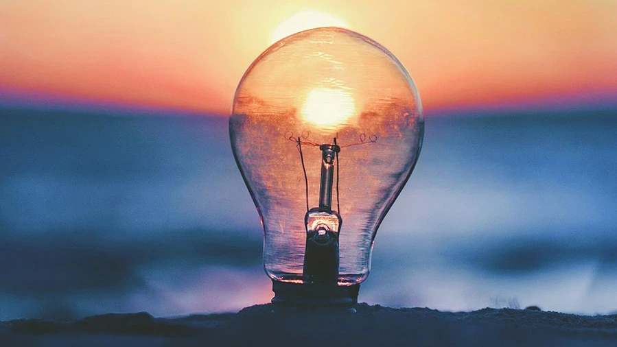

# Bitácora de Clases

---

## Noviembre

### Día 14/11/2025

#### En la clase de hoy
Hoy hemos estado hablando sobre las energías y la manera en que se extraen. Las dos principales fuentes de energía son: el sol y la energía nuclear. Estas son dos energías que nos aportan una gran variedad de ventajas para la supervivencia.

**El viaje oculto del producto:**  
Cómo los seres humanos fabricamos todo lo que está en nuestras manos para vivir mejor. Todo lo que fabricamos tiene un proceso que puede conllevar inconvenientes.

#### Ejemplo
Un teléfono móvil: es algo simple que, detrás, conlleva un gasto de recursos bastante elevado.  
¿Cómo es posible este "peso oculto"? Se refiere a las diferentes fases de fabricación de los materiales.

#### Tipos de economía

**Economía lineal:**
- Modelo tradicional: “producir → consumir → desechar”.
- Los recursos se extraen, se usan y luego se tiran.
- Problema: genera muchos residuos y agota los recursos naturales.
- Ejemplo: comprar un móvil, usarlo y tirarlo cuando deja de funcionar, sin reciclar sus materiales.

**Economía circular:**
- Modelo sostenible: “reducir → reutilizar → reciclar”.
- Los productos se diseñan para durar más, repararse y reincorporar sus materiales al ciclo productivo.
- Beneficios: menos residuos, ahorro de recursos y menor impacto ambiental.
- Ejemplo: reciclar un móvil viejo para recuperar metales y plásticos que se usarán en nuevos dispositivos.

**Análisis del ciclo de vida:**  
Metodologías para evaluar el impacto ambiental de un producto en la tierra:
1. Materias primas: extracción de recursos de la tierra.
2. Fabricación: proceso industrial, ensamblaje y embalaje del producto.
3. Distribución: transporte del producto final a las tiendas.
4. Uso: vida del producto con el consumidor, incluido el mantenimiento.
5. Gestión final: desecho del producto.

#### ¿Cuántas toneladas de embalaje hacen falta para fabricar los elementos?
**Objeto elegido:** Teléfono  
Un teléfono móvil de unos 200 gramos puede requerir cientos de kilogramos de materiales y energía si sumamos todo lo que se usa en su producción (materiales ocultos incluidos). Esto explica por qué la reciclabilidad y el diseño sostenible son tan importantes. Los materiales ocultos representan una parte enorme de su huella.

## Conclusión
En la clase de hoy aprendimos que, aunque las energías como la solar y la nuclear nos aportan grandes beneficios, debemos ser conscientes del impacto oculto que tiene la producción de los objetos que usamos diariamente. Cada producto, desde su extracción de materias primas hasta su desecho final, genera un “peso oculto” en recursos y energía. Comprender la diferencia entre economía lineal y circular nos permite valorar la importancia de diseñar productos sostenibles, reutilizables y reciclables, reduciendo así nuestro impacto ambiental. Este análisis nos recuerda que nuestras decisiones de consumo tienen consecuencias reales sobre el planeta y que podemos contribuir a un futuro más sostenible adoptando hábitos responsables y promoviendo la economía circular.

---

## Octubre

### 31 de octubre
En la clase de hoy hemos estado hablando sobre la tierra y sus recursos, de cómo hace años todos los recursos eran más abundantes y accesibles, y de cómo en estos últimos años todos esos recursos están empezando a escasear.

#### ¿La tierra es un sistema finito?
Desde mi punto de vista, es algo imposible de saber, ya que la tierra y el universo tienen muchas partes sin investigar.

---

### 24 de octubre

#### ¿Hay un límite en la población humana?
Yo pienso que todo tiene un límite, y está claro que cuanto más avanza la vida y la evolución de las especies, más sobreexplotamos todos los medios. Cada vez los recursos son más escasos, por lo que pienso que llegará el momento en que el límite sea más pequeño.  
Para ello, debemos replantearnos hoy si deberíamos seguir con este ritmo de consumismo.

#### ¿Qué estrategias usamos los humanos?
La estrategia K, ya que nos adaptamos a los cambios y nos centramos en mejorar todo lo que nos rodea, pero siempre buscando que todo tenga equilibrio y estabilidad.

---

### 17 de octubre
En la clase de hoy hemos hablado sobre si convivimos con más seres vivos.

#### ¿Qué hacemos nosotros: cooperamos o competimos?
Desde mi punto de vista, las personas hacemos ambas cosas.  
Cooperamos para hacer que la vida sea mejor y que todos podamos acceder a los mismos recursos, también para que los derechos de las personas sean posibles.  
También competimos para obtener mejores productos, alimentos y reconocimiento, así como para demostrar nuestras capacidades y habilidades.

---

### 3 de octubre
En la clase de hoy se ha comentado brevemente el parecido entre las necesidades de las personas y las de los animales, sobre cómo somos seres similares a los animales, pero la conclusión es que estamos destrozando la naturaleza mientras los animales la reconstruyen.

#### ¿Acabaremos con la vida en nuestro planeta?
Yo pienso que con el planeta no vamos a acabar, y con la vida tampoco.  
Acabaremos con la mayoría de especies, como la nuestra. Los humanos somos los que más riesgo corremos, ya que estamos explotando cada vez más el planeta, estamos haciendo que el clima y todo cambie a nuestro paso, y por ello opino que vamos a ser los primeros en extinguirnos o seremos los causantes de destruir todo lo que nos rodea.  
Pero el planeta agradecerá cuando desaparezcamos, seguirá con su ciclo y se volverá a reproducir...

---

## Septiembre

### 26 de septiembre
En la clase de hoy hemos hablado sobre el concepto de sostenibilidad y todo lo que engloba esa palabra en la vida diaria.
